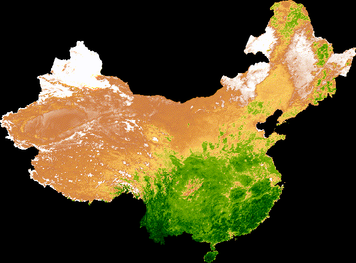

# NDVI Analysis in Google Earth Engine
## Introduction
This lab is to create an animation for the median NDVI in one country on Google earth engine. The data source is MODIS vegetation indices dataset. This lab helps us to know how to 
* Fetch the remote sensing data on Google Earth Engine
* Define region of interest and animation frame geometries
* Group images from the same annual 16-day composite window using a join
* Define visualization parameters and convert data into RGB visualization images

## Challenges
I wanted to create an animation for median NDVI in China. I found it was hard to get the mask and region from the dataset Large Scale International Boundary. At first, I used the feature "wld_rgn" to search the boundaries for China. However, the function didn't find the result. Then, I found that the dataset provided the feature “country_co” which is the two-letter FIPS country code to find the target country. It avoided the situation that there are multiple names for one country (like US, USA, the United States, and the States). I got a FeatureCollection as the mask.

Notice that there are four features in the mask FeatureCollection for China. I use the Union function to make it as one. Then, I print out the bounds feature of mask to get the four coordinates of the region.

## Result

## Analysis
From the animation. we can see:
* The NDVI in the west of China is always low. The potential reason is that the west of China is mostly covered by desert.
* The NDVI in the south of China is always high. The reasons could be that the south of China is warmer than the North of China, that the density of vegetation in the south of China is higher than the north, or that there is less snow in the south of China in the winter than the north.
* The NDVI in the northeastern China shows a seasonal pattern. NDVI is low in fall and winter, and high in spring and summer.
